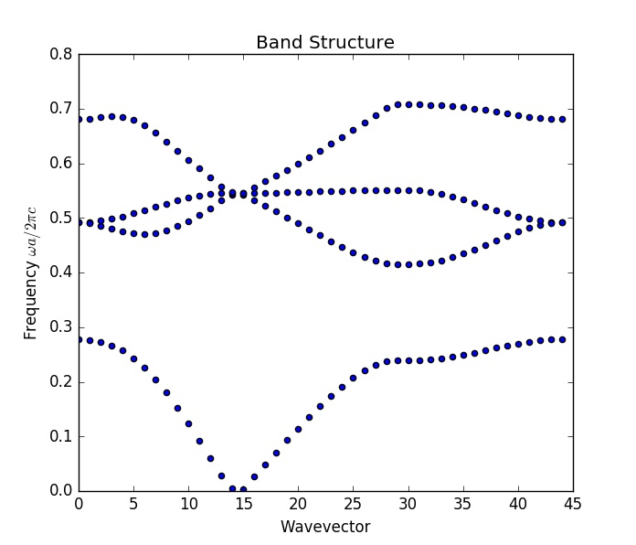
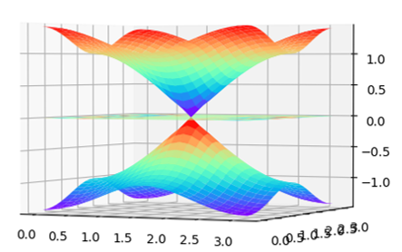

# PlaneMeta
> Optical Two-dimensional Calculation System

## Features
+ Bulk/Edge Eigenvalues and Eigenvectors
+ Iso-frequency Contour
+ Transmission/Reflection Calculation

## Examples
+ Huang X, Lai Y, Hang Z H, et al. Dirac cones induced by accidental degeneracy in photonic crystals and zero-refractive-index materials[J]. Nature materials, 2011, 10(8): 582-586.

+ Tight-binding Hamiltonian

## Status
Working on it...

## E-mail
longyang_123@yeah.net  
You're most welcome to contact with to discuss the details about this project